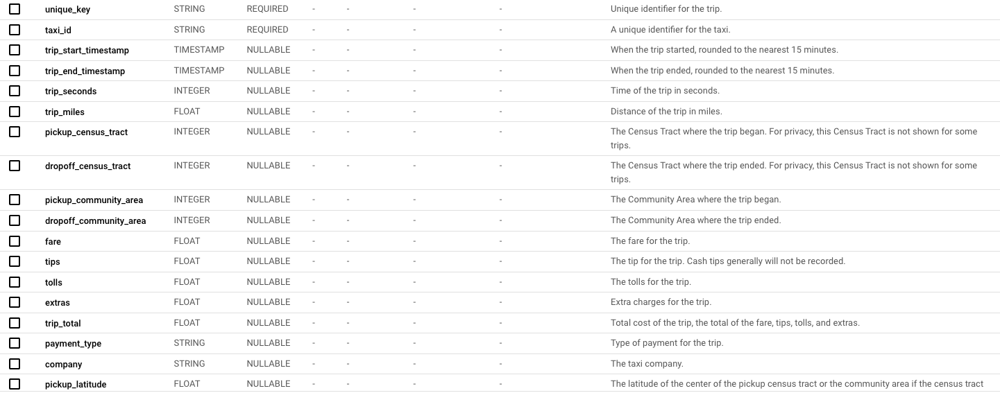
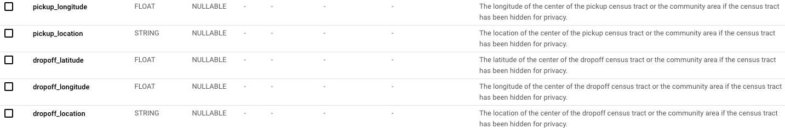

# BDA_project_grH
Projet BDA du groupe H - Machado Jorge, Acevedo Valentin

## Phase 1
Dataset selection

## First choice
### Crime Data from 2020 to Present

- Size = 911k rows for 28 columns (Size in gb not specified)
- Schema = 

- https://data.lacity.org/Public-Safety/Crime-Data-from-2020-to-Present/2nrs-mtv8/about_data

## Second choice
### Enron email dataset
- Size = 1.7Gb 
- Schema = 

- https://www.cs.cmu.edu/~enron/

## Third Choice
### Chicago taxi trips

- Size = 37,2 Go
- Schema = 

- https://console.cloud.google.com/bigquery?project=mobile-champignons&ws=!1m4!1m3!3m2!1sbigquery-public-data!2schicago_taxi_trips

